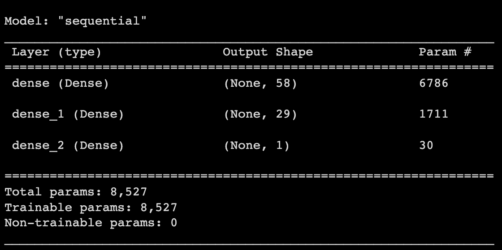
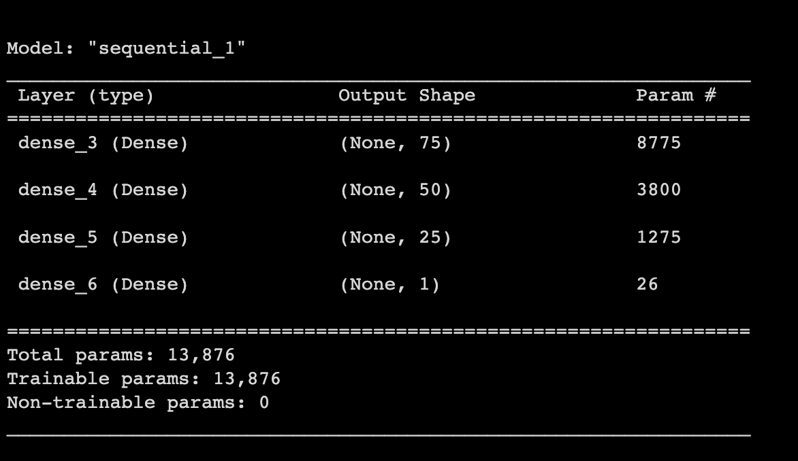
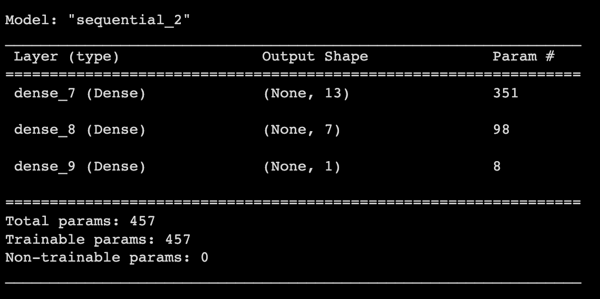

# Venture Funding with Deep Learning

You work as a risk management associate at Alphabet Soup, a venture capital firm. Alphabet Soup’s business team receives many funding applications from startups every day. This team has asked you to help them create a model that predicts whether applicants will be successful if funded by Alphabet Soup.

The business team has given you a CSV containing more than 34,000 organizations that have received funding from Alphabet Soup over the years. With your knowledge of machine learning and neural networks, you decide to use the features in the provided dataset to create a binary classifier model that will predict whether an applicant will become a successful business. The CSV file contains a variety of information about these businesses, including whether or not they ultimately became successful.

## Instructions

Full instructions are contained in the "Instructions.md" file.

### Step 1: Prepare the Data for Use on a Neural Network Model

1. Read the `applicants_data.csv` file into a Pandas DataFrame.

2. Prepare the data for binary classification:
    * Drop the “EIN” (Employer Identification Number) and “NAME” columns
    * Encode the dataset’s categorical variables using `OneHotEncoder`, and then place the encoded variables into a new DataFrame.
    * Add the original DataFrame’s numerical variables to the DataFrame containing the encoded variables.

3. Using the preprocessed data, create the features (`X`) and target (`y`) datasets. 
    * The target dataset is the “IS_SUCCESSFUL” column
    * The remaining columns should define the features dataset

4. Split the features and target sets into training and testing datasets.

5. Use scikit-learn's `StandardScaler` to scale the features data.

### Step 2: Compile and Evaluate a Binary Classification Model Using a Neural Network

Use your knowledge of TensorFlow to design a binary classification deep neural network model. This model should use the dataset’s features to predict whether an Alphabet Soup&ndash;funded startup will be successful based on the features in the dataset.

1. Create a deep neural network by assigning the number of input features, the number of layers, and the number of neurons on each layer using Tensorflow’s Keras.

2. Compile and fit the model using the `binary_crossentropy` loss function, the `adam` optimizer, and the `accuracy` evaluation metric.

3. Evaluate the model using the test data to determine the model’s loss and accuracy.
 268/268 [==============================] - 1s 2ms/step - loss: 0.6289 - accuracy: 0.7277
Loss: 0.6289443373680115, Accuracy: 0.7276967763900757

4. Model saved to file `AlphabetSoup.h5`.

### Step 3: Optimize the Neural Network Model

Using your knowledge of TensorFlow and Keras, optimize your model to improve the model's accuracy. 

### Alternative One
In this alternative, we added one more layer to the analysis and updated the number of nodes.  

The structure of this model is:

The results of this model is:
 
Alternative Model 1 Results
268/268 - 0s - loss: 0.5580 - accuracy: 0.5292 - 484ms/epoch - 2ms/step
Loss: 0.5580395460128784, Accuracy: 0.5292128324508667

The model is saved as 'AlphabetSoup_A1.h5

### Alternative Two
In this alternative, we removed a few of the orignial columns to see if they had any affect on the accuracy.  We also changed the activation model to sigmoid.

The structure of this model is:

The results of this model is:
 
Alternative Model 2 Results
268/268 - 0s - loss: 0.5977 - accuracy: 0.7011 - 394ms/epoch - 1ms/step
Loss: 0.5976747274398804, Accuracy: 0.7011078596115112

The model is saved as 'AlphabetSoup_A2.h5

## Step 4: Compare the results
As we can see from the outputs above, the original model was the most accurate with an accuracy of 72.8%.  The Second model had the worse accuracy at 52.9%.  The last model was slightly worse than the original model with an accuracy of 70.1%.  None of these models are extremely accurate as we would like to see accuracy over 90%, so more analysis is needed for a full report.
